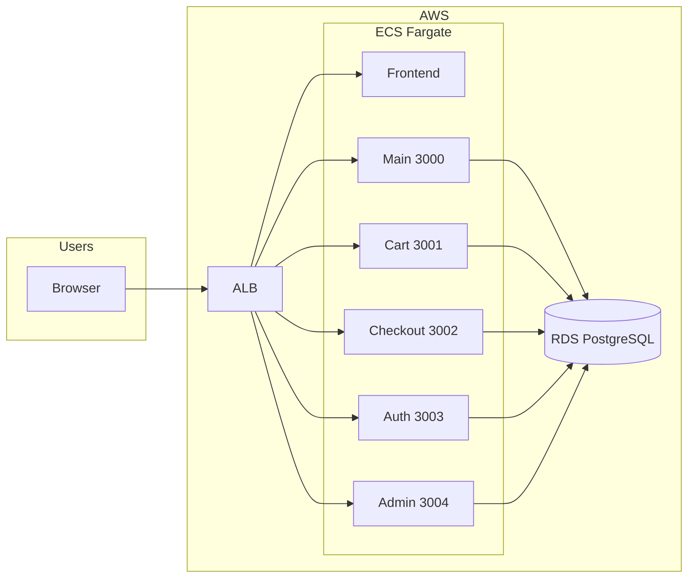

# DevOps Interview Prep: Retail Store Project

Tài liệu hỗ trợ phỏng vấn vị trí DevOps: cách giới thiệu dự án, câu hỏi thường gặp và kịch bản role-play.

---

## 1. How to present the project (candidate script)

### Opening (30–60s)

"Đây là project web bán thú nhồi bông: frontend React/Vite, backend Express tách thành 5 service (main, cart, checkout, auth, admin), database PostgreSQL. Mình đảm nhiệm phần infra trên AWS bằng Terraform, CI/CD qua GitHub Actions, và observability chỉ trên production."

### Architecture (high level)

### Talking points

- **Infra:** Hai môi trường Terraform: `terraform-staging/` và `terraform-prod/`. Cả hai có VPC (public/private subnets, optional NAT), ALB path-based routing, ECS Fargate (1 frontend + 5 backend), ECR, RDS PostgreSQL (optional). Prod thêm: service discovery (Cloud Map, namespace `retail-store.local`) và observability (Prometheus, Grafana, Loki).
- **Data:** Một DB dùng chung: `backend/prisma/schema.prisma`, `DATABASE_URL` inject qua ECS task definition. Seed qua `backend/prisma/seed.js`; prod seed chạy one-off Fargate task từ workflow.
- **Backend:** 5 service Node/Express, mỗi service một port (3000–3004), cùng Prisma và một `DATABASE_URL`. Deploy bằng ECS Fargate; không dùng EC2.
- **CI/CD:** `.github/workflows/deploy-staging.yml` — push main → build frontend/backend, push ECR, update ECS staging. `load-test-prod.yml` — k6 chạy theo cron hoặc manual, dùng secret `PROD_URL`. `seed-prod.yml` — manual seed prod. `for-prod-repo/rollback-prod.yml` — rollback ECS về task definition `prod-previous`.
- **Secrets:** Terraform: `terraform.tfvars` hoặc `TF_VAR_`* (db_password, jwt_secret, admin_jwt_secret, grafana_admin_password). GitHub: `AWS_ACCESS_KEY_ID`, `AWS_SECRET_ACCESS_KEY`, `AWS_ACCOUNT_ID`, `PROD_URL` cho load test.
- **Monitoring (prod only):** `terraform-prod/observability.tf` + module `terraform-prod/modules/observability`. Prometheus scrape `/metrics` của từng backend qua service discovery; Grafana tại `/grafana` trên ALB. Custom metrics trong `backend/services/metrics.js`: `product_sales_total`, `auth_logins_total`, `checkout_payments_total`. Load test `scripts/load/k6-prod.js` mô phỏng full flow (register → login → cart → checkout COD/card → orders) để tạo traffic và metrics.

---

## 2. Likely interviewer questions and key answers

| Câu hỏi                                            | Ý trả lời ngắn                                                                                                                                                                                                                                            |
| -------------------------------------------------- | --------------------------------------------------------------------------------------------------------------------------------------------------------------------------------------------------------------------------------------------------------- |
| **Staging và prod khác nhau thế nào?**             | Cùng VPC, ALB, ECS, RDS, ECR. Prod có thêm service discovery (Prometheus scrape backend qua DNS), observability stack (Prometheus, Grafana, Loki), và biến/secret riêng (JWT, Grafana password). Staging không có observability.                          |
| **Tại sao tách 5 backend service thay vì 1?**      | Tách theo domain (product/likes, cart, checkout, auth, admin), dễ scale từng phần và deploy độc lập; tất cả dùng chung DB và Prisma schema.                                                                                                               |
| **Service discovery dùng để làm gì?**              | Prometheus trong VPC cần scrape từng backend tại `main.retail-store.local:3000`, v.v. ALB không expose từng port; Cloud Map cho phép ECS task đăng ký DNS nội bộ, Prometheus dùng DNS đó trong `terraform-prod/modules/observability/prometheus.yml.tpl`. |
| **Secrets quản lý thế nào?**                       | Terraform: tfvars (không commit giá trị thật) hoặc TF_VAR; GitHub Actions: repository secrets (AWS credentials, PROD_URL). Chưa dùng Secrets Manager/Parameter Store inject vào ECS — có thể nói đây là bước cải thiện.                                   |
| **Rollback làm thế nào?**                          | Workflow rollback-prod (trong for-prod-repo) update tất cả ECS service về task definition tag `prod-previous`. Cần trước đó đã tag image/task definition "previous" khi deploy thành công.                                                                |
| **Load test chạy ở đâu, có ảnh hưởng prod không?** | Chạy trên GitHub Actions runner, gửi HTTP tới prod ALB (PROD_URL). Có ảnh hưởng prod (tạo traffic và load); có thể nói thêm: có thể giới hạn cron hoặc chỉ chạy manual.                                                                                   |
| **Tại sao monitoring chỉ ở prod?**                 | Giảm cost và độ phức tạp staging; staging dùng để test tính năng, prod mới cần theo dõi latency, lỗi, business metrics (sale, login, payment).                                                                                                            |
| **Custom metrics có những gì?**                    | `product_sales_total` (product_slug, category_slug), `auth_logins_total`, `checkout_payments_total` (payment_method: cod/card). Tăng ở checkout và auth router; Prometheus scrape từ endpoint `/metrics` của từng service.                                |

---

## 3. Role-play structure

**Format:** 2 vai — Interviewer (IT) và Candidate (Bạn). Luân phiên 1–2 vòng hỏi/đáp ngắn, sau đó có thể đào sâu theo hướng interviewer chọn.

### Vòng 1 — Giới thiệu dự án (2–3 phút)

- **IT:** "Anh/chị giới thiệu qua kiến trúc và trách nhiệm DevOps của anh/chị trong project này."
- **Candidate:** Dùng phần "How to present the project" ở trên (opening + architecture + infra/data/backend/CI/CD/monitoring tóm tắt).

### Vòng 2 — Câu hỏi kỹ thuật (3–5 phút)

- **IT:** Chọn 2–3 câu từ bảng "Likely interviewer questions" (ví dụ: staging vs prod, service discovery, secrets, rollback).
- **Candidate:** Trả lời theo cột "Ý trả lời ngắn", có thể thêm chi tiết từ repo (tên file, flow).

### Vòng 3 — Đào sâu (tùy chọn)

- **IT:** "Nếu mở rộng thêm môi trường (vd pre-prod), anh/chị sẽ làm những bước gì?" hoặc "Cách anh/chị đảm bảo Terraform state an toàn khi làm việc team?"
- **Candidate:** Trả lời dựa trên hiện trạng (terraform state có thể dùng S3 + DynamoDB lock; pre-prod có thể copy terraform-prod, đổi biến, tách state).

### Refinement trước khi role-play

- In hoặc mở sẵn: README, MONITORING.md, danh sách workflows, cấu trúc terraform-staging vs terraform-prod.
- Chuẩn bị 1–2 câu "Mình sẽ cải thiện thêm…" (secrets trong AWS, state lock, blue/green hoặc canary nếu có thời gian).

---

## 4. Cách rollback hoạt động (chi tiết)

Dùng khi interviewer hỏi sâu "Rollback làm thế nào?" hoặc "Giải thích flow rollback."

### Hai phần chính

- **Chuẩn bị "bản cũ":** Mỗi lần deploy prod, ECR được giữ 2 tag: `prod-latest` (bản đang chạy) và `prod-previous` (bản trước đó).
- **Khi rollback:** Workflow không dùng sẵn task definition tên "prod-previous"; nó **tạo task definition mới** trỏ image sang tag `prod-previous`, rồi bảo ECS chạy bản đó.

### Khi deploy prod (chuẩn bị cho rollback)

Trong `.github/workflows/deploy-staging.yml` (job deploy prod):

1. **Trước khi build/push image mới:** Với mỗi ECR repo (frontend, backend), workflow lấy **manifest của image đang tag `prod-latest`** (bản đang chạy), rồi **gắn thêm tag `prod-previous`** cho đúng manifest đó (`aws ecr put-image --image-tag prod-previous --image-manifest ...`). Trên ECR: cùng một image có 2 tag: `prod-latest` và `prod-previous`.
2. **Sau đó:** Build image mới, push với tag `prod-latest` (và `prod-<sha>`). `prod-latest` trỏ sang bản mới, `prod-previous` vẫn trỏ bản vừa "lùi" lại (bản cũ).
3. **Update ECS:** `update-service --force-new-deployment` (không đổi task definition). ECS vẫn dùng task definition đang khai báo image `...:prod-latest`, nên kéo bản mới và chạy.

**Kết quả:** Mỗi lần deploy prod thành công, ECR luôn có `prod-latest` = bản vừa deploy, `prod-previous` = bản ngay trước đó (dùng để rollback).

### Khi chạy rollback

Workflow: `.github/workflows/for-prod-repo/rollback-prod.yml` (copy vào repo prod thành `rollback-prod.yml`).

Với từng service (`frontend`, `main`, `cart`, `checkout`, `auth`, `admin`):

1. **Lấy task definition hiện tại** — `aws ecs describe-task-definition --task-definition <cluster>-<svc>`. Task definition này đang trỏ image `...:prod-latest`.
2. **Sửa JSON** — Giữ nguyên family, CPU, memory, env,… chỉ đổi **image** từ `...:prod-latest` sang `...:prod-previous`.
3. **Đăng ký task definition mới** — `aws ecs register-task-definition --cli-input-json file:///tmp/td.json` → tạo revision mới của cùng family, trong đó container dùng image `:prod-previous`.
4. **Cập nhật ECS service** — `aws ecs update-service --task-definition <NEW_ARN> --force-new-deployment` → ECS chuyển service sang chạy revision vừa tạo (image `:prod-previous`), drain task cũ và start task mới.

**Kết quả:** Cả 6 service chuyển sang chạy image tag `prod-previous` (bản trước lần deploy gần nhất). Không cần có sẵn task definition tên "prod-previous"; workflow tự tạo revision mới chỉ đổi image tag.

### Luồng tóm tắt

- **Deploy lần 1:** ECR `prod-latest` = v1; ECS chạy v1.
- **Deploy lần 2:** (1) ECR: manifest của prod-latest (v1) gắn thêm tag `prod-previous`. (2) Build v2, push `prod-latest` = v2. (3) ECS force-new-deployment → chạy v2. Sau đó ECR có `prod-latest` = v2, `prod-previous` = v1.
- **Rollback:** Với mỗi service: tạo task def mới (image `:prod-previous` = v1) → update-service → ECS chạy lại v1.

### Điều kiện rollback thành công

- ECR giữ ít nhất 2 tag (`prod-latest`, `prod-previous`). Terraform prod có ECR lifecycle policy "keep last 3 images" (`terraform-prod/ecr.tf`) để tránh xóa mất `prod-previous`.
- Deploy prod phải chạy đủ bước "Tag current prod-latest as prod-previous" trước khi push image mới.
- Workflow rollback cần quyền ECS (describe-task-definition, register-task-definition, update-service). Biến: `ECS_CLUSTER`, `AWS_REGION`; secrets: AWS credentials.

